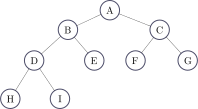

<link rel="stylesheet" href="https://maxcdn.bootstrapcdn.com/bootstrap/3.4.1/css/bootstrap.min.css">

# PHP Tree Support

    

A class to support bitmask operations.
## Install
    composer require calabrothers/php-ds-tree

## Test
    composer install
    composer test

## Tree Library
Referring to the example tree:

We can introduce the following relevant information to discuss library functionality:

<table class="table">
<thead>
<tr>
<th>Set</th>
<th>Value</th>
</tr>
</thead>
<tbody>
<tr><td>Root Node</td><td>A</td></tr>
<tr><td>Leaves</td><td>{H, I, E, F, G}</td></tr>
</tbody>
</table>

Relationship with other nodes:

<table class="table">
<thead>
<tr>
<th>Set</th>
<th>Value</th>
</tr>
</thead>
<tbody>
<tr><td>Children(A)</td><td>{ B , C }</td></tr>
<tr><td>Parent(B)</td><td>A</td></tr>
<tr><td>Siblings(D)</td><td>{ E, F, G }</td></tr>
<tr><td>Descendants(B)</td><td>{ D, E, H, I }</td></tr>
<tr><td>Anchestors(H)</td><td>{ D, B, A }</td></tr>
</tbody>
</table>

For each of this set, an additional set is defined including the argument itself, hence:

<table class="table">
<thead>
<tr>
<th>Set</th>
<th>Value</th>
</tr>
</thead>
<tbody>
<tr><td>ChildrenAndSelf(A)</td><td>{ A, B , C }</td></tr>
<tr><td>SiblingsAndSelf(D)</td><td>{ D, E, F, G }</td></tr>
<tr><td>DescendantsAndSelf(B)</td><td>{ B, D, E, H, I }</td></tr>
<tr><td>AnchestorsAndSelf(H)</td><td>{ D, B, A }</td></tr>
</tbody>
</table>

### Static functions:
As Ds\Deque object, the Tree library provides access to the following operations:

- **apply** (change the value of the node with a callable)
- **filter** (select a subset of nodes where the condition is specified with a a callable)
- **map** (evaluate the nodes value to compute the result given with a callable)

These basic operation are provided as static functions and they operate with a given set of nodes. A magic function provide access to all the previously defined sets.

Example: Let us calculate 

        y = 2 x sum( Descendants(A) )

First we need to get a set of nodes given as Descendants(A), then apply a map to double the value. Finally we should sum the elements of the resulting vector.

    // Let build some tree...
    /*
            A(1)
            /    \    
        B(2)   C(3)
                /   \
                D(4)  E(5)  

    */
    $oA = new TreeNode(1);
    $oB = new TreeNode(2);
    $oC = new TreeNode(3);
    $oD = new TreeNode(4);
    $oE = new TreeNode(5);

Connect the nodes to form the tree:

    // Connects the nodes
    $oC->attachChild($oD);
    $oC->attachChild($oE);
    $oA->attachChild($oB);
    $oA->attachChild($oC);

Compute the result:

    // Compute 2 x Value, forall the Descendants(A)
    $aValue = TreeNode::mapSet(
        $oA->getDescendants(), 
        function ($oValue) {
            return 2 * $oValue;
        }
    );
    echo $aValue->sum()."\n"; // 28

Referring to the same tree, we can for example get the list of nodes having even value as:

    // Get nodes having even value
    $aEven = TreeNode::filterSet(
        $oA->getNodes(),
        function ($oValue) {
            return $oValue % 2 == 0;
        }
    );

    echo "(".$aEven[0]->getValue().",".$aEven[1]->getValue().")"; // (2,4)

## Tree Builder
Library provides a convenient class to help construction of trees.

The builder requires a callable, responsible to build new nodes. For example considering a tree of integer values:

    $oTreeC = new TreeBuilder(
                function (int $nNumber) : int { 
                    return $nNumber; 
                }
            );

With this information, everytime the function begin() is called, a new node is added, forwarding the parameters of the begin() function to the callable function specified in the TreeBuilder constructor.

    $oTreeC
        ->begin(1)
            ->begin(2)
            ->end()
            ->begin(3)
                ->begin(4)
                ->end()
                ->begin(5)
                ->end()
            ->end()
        ->end();
    

It is possible for all the types with a proper __toString() method to see the node values. For instance, in this case:

    echo $oTree;
    // Result:
    ┌1
    └────2
    └────3
        └────4
        └────5
The TreeBuilder is interesting when combined with custom node class, for example, let us consider to build a Tree having as nodes the object of following class:

    class TreeNodeExample {
        public $nX;
        public $szY;
        public function __construct(int $nX, string $szY) {
            $this->nX   = $nX;
            $this->szY  = $szY;
        }

        public function myMultiply(int $nZ) {
            $this->nX *= $nZ;
            $this->szY = implode("+", array_fill(0, $nZ,$this->szY));
        }

        public function __toString():string {
            return "($this->nX|$this->szY)";
        }
    }

Then we can use a TreeBuilder as:

    $oTreeC = new TreeBuilder(
        function (int $nX, string $szY) : TreeNodeExample { 
            return new TreeNodeExample($nX, $szY); 
        }
    );
        
    $oTreeC
        ->begin(1, 'one')
            ->begin(2, 'two')
            ->end()
            ->begin(3, 'three')
                ->begin(4, 'four')
                    ->myMultiply(2)  // This will call the method of TreeNodeExample! :)
                ->end()
                ->begin(5, 'five')
                    ->myMultiply(3)
                ->end()
            ->end()
        ->end();

    echo $oTreeC;

    ┌(1|one)
    └────(2|two)
    └────(3|three)
        └────(8|four+four)
        └────(15|five+five+five)

## Notes
I strongly reccomend to use PHP Ds extension rather than its equivalent Php version.
Check https://github.com/php-ds/ext-ds for more information.

### Credits
- [Vincenzo Calabrò](www.cybertronics.cloud/vc)

### Support quality code

### License

The MIT License (MIT). Please see [LICENSE](LICENSE.md) for more information.
